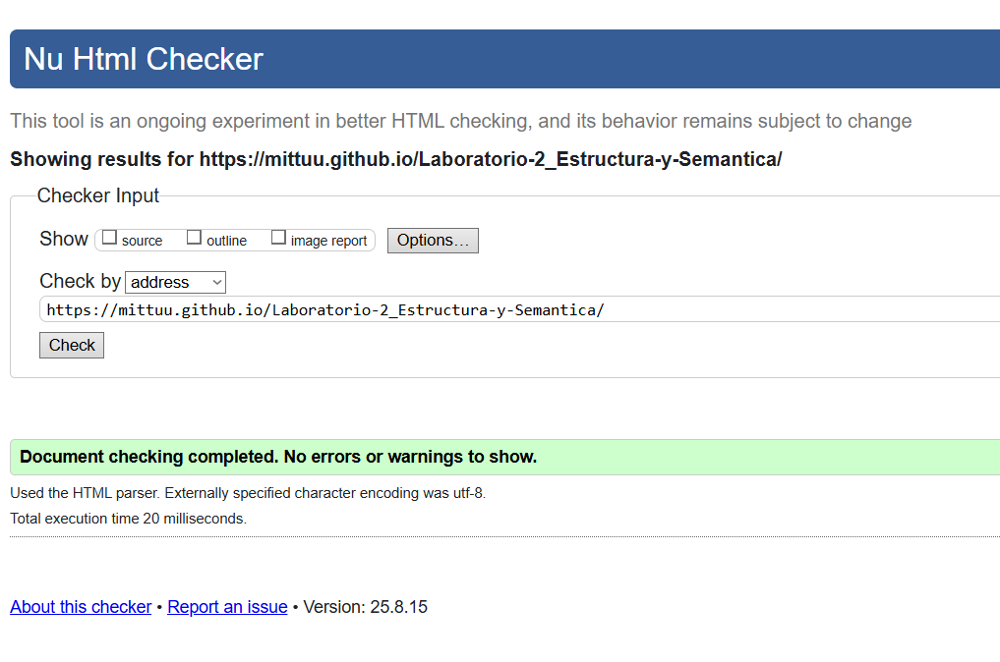
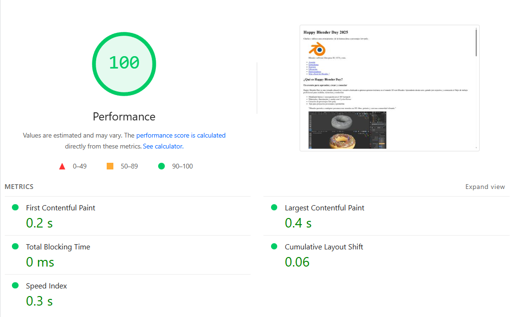
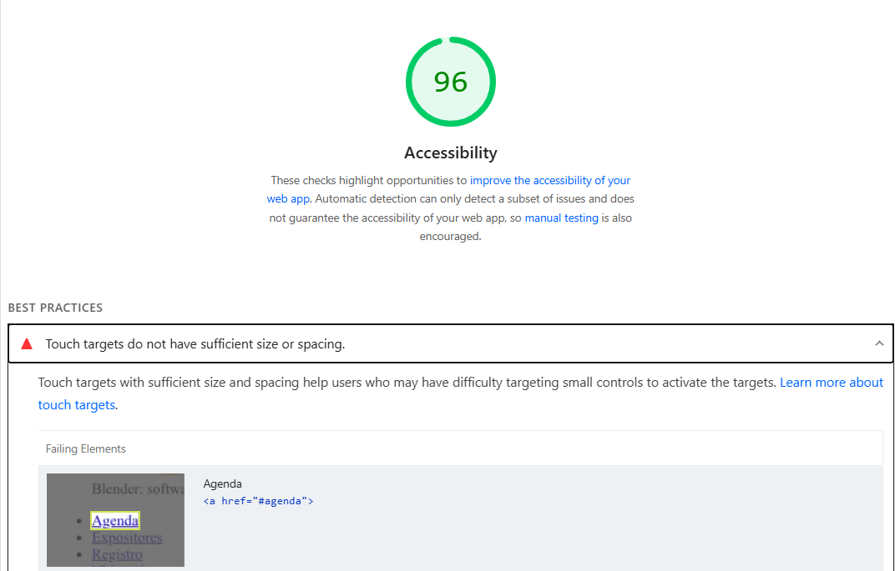
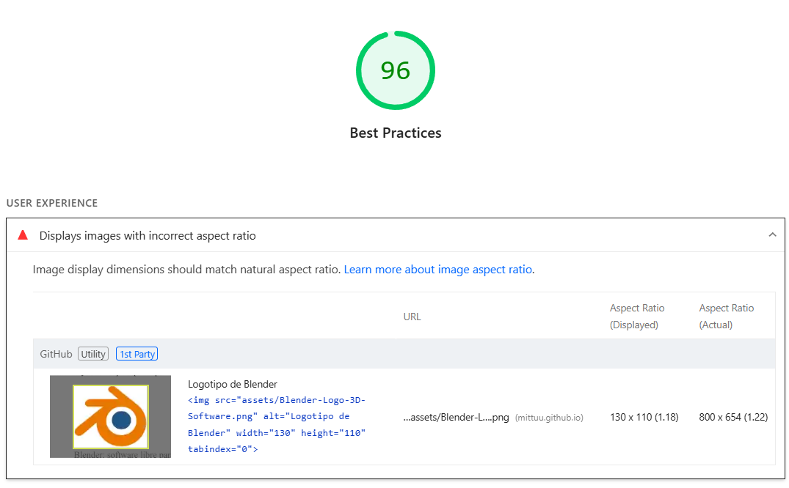
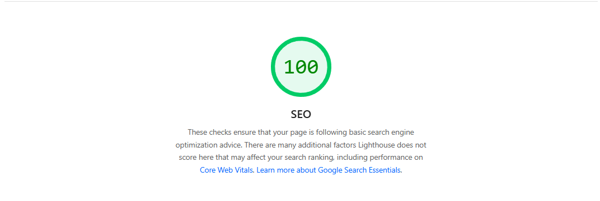

# Happy Blender Day 2025 - Sitio del Evento

## Descripción
Sitio web para el evento "Happy Blender Day 2025", que ofrece charlas y talleres de introducción a Blender para principiantes. Incluye agenda, información de expositores, formulario de registro, ubicación y patrocinadores.

---

## Estructura Semántica
- **`<header>`**: Cabecera con logo, título y navegación principal.
- **`<nav>`**: Menú de enlaces internos y externos.
- **`<main>`**: Contenido principal del sitio.
- **`<section>`**: Divide las secciones temáticas (agenda, expositores, etc.).
- **`<article>`**: Contenido independiente dentro de secciones (ej: detalles de talleres).
- **`<figure>` + `<figcaption>`**: Imágenes con descripciones accesibles.
- **`<footer>`**: Información de derechos y enlace de retorno.

---

## URL Pública
[Despliegue en Github Pages](https://mittuu.github.io/Laboratorio-2_Estructura-y-Semantica)

---

## Validación W3C
- **Resultado**: Documento HTML válido sin errores.  

  

---

## Lighthouse
### Puntuaciones (Desktop):
#### **Rendimiento**: 100/100 

  

#### **Accesibilidad**: 96/100 *(Mejora: tamaño de touch targets)*

  

#### **Mejores Prácticas**: 96/100 *(Mejora: política HSTS fuerte)*

  

#### **SEO**: 100/100

  

### Plan de Mejoras:
1. **Optimizar imágenes**: Reducir peso sin perder calidad (ahorro estimado: 418 KiB).
2. **Cache eficiente**: Ajustar cabeceras HTTP (ahorro estimado: 436 KiB).
3. **Accesibilidad**: Aumentar tamaño de botones y enlaces para dispositivos táctiles.

---

## Accesibilidad Aplicada
- **`tabindex`**: 
  - `tabindex="0"` en logo para enfoque con teclado.
  - `tabindex="-1"` en imágenes decorativas (ej: dona) para excluirlas del tabulado.
- **`aria-*`**:
  - `aria-label` en menú principal y botones (ej: "Menú principal", "Enviar registro").
  - `aria-labelledby` en secciones para asociar títulos con contenido.
- **`alt`**: Texto descriptivo en todas las imágenes (ej: "Logotipo de Blender").
- **Enlaces descriptivos**: Textos claros (ej: "Sitio oficial de Blender ↗") y `rel="noopener"` para seguridad.